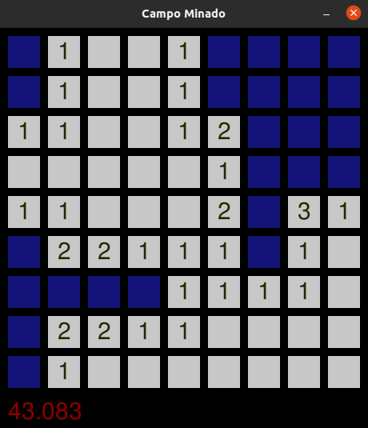

# Minesweeper

[versão em português](README.pt.md)

Implementation of a minesweeper type game to play around with the matrix concept
and the pygame library.

The game is played using the buttons left and right of the mouse.

Run the game: `$ python main.py`

