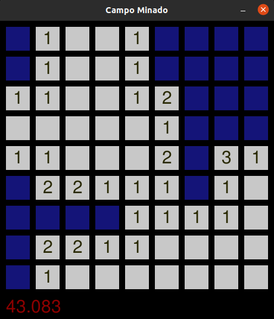

# Campo Minado

[english version](README.md)

Implementação de um game de campo minado para brincar com o conceito de
matriz utilizado a biblioteca pygame.

O game é jogado usando os botões direito e esquerdo do mouse.

Executar o jogo: `$ python main.py`
